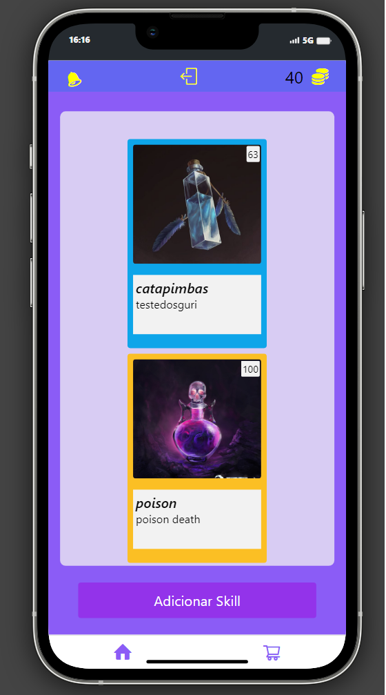

# Tamago App

## Funcionalidades Principais

- **Criação de skills:** Crie e personalize suas próprias habilidades com descrições detalhadas e imagens atraentes.
- **Venda de skills:** Coloque suas habilidades à venda no mercado interno do aplicativo para outros usuários comprarem.
- **Compra de skills:** Explore o mercado interno para descobrir e adquirir novas habilidades de outros usuários.

1. **Criação de Habilidades:**
   - Toque no botão de criação de habilidades no menu principal.
   - Preencha os detalhes da habilidade, como nome, descrição e imagem.
   - Salve a habilidade e ela estará pronta para ser vendida ou compartilhada.

2. **Venda de Habilidades:**
   - Vá para a seção "Minhas Habilidades" no seu perfil de usuário.
   - Selecione a habilidade que deseja vender e escolha a opção "Colocar à Venda".
   - Defina um preço justo e aguarde os compradores interessados.

3. **Compra de Habilidades:**
   - Explore o mercado interno na seção "Explorar Habilidades".
   - Encontre habilidades que correspondam aos seus interesses e necessidades.
   - Toque em uma habilidade para ver detalhes e, se estiver interessado, compre-a com facilidade.

## Contribuição

Se você deseja contribuir para o desenvolvimento deste aplicativo, por favor, siga estas etapas:

1. Fork este repositório.
2. Crie sua própria branch de recurso (`git checkout -b feature/AmazingFeature`).
3. Faça commit de suas alterações (`git commit -m 'Add some AmazingFeature'`).
4. Envie para a branch (`git push origin feature/AmazingFeature`).
5. Abra um pull request.

## Licença

Este projeto é licenciado sob a [Licença MIT](https://opensource.org/licenses/MIT) - consulte o arquivo `LICENSE` para obter mais detalhes.
